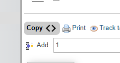

# phpmyadmin-csharp-class
a simple chrome v3 extension which injects a "Copy" button into phpMyAdmin to copy the mysql table as a C# class to your clipboard.

load as an unpacked extension



```
# manifest.json

// your domain here, or all
"matches": [
     "https://jsnell.dev/*"
]
```

```
# foreground.js

// add new types here, everything before the last index is converted to the last index.
const typeMap = [
    ["varchar", "text", "string"], // varchar, text convert to string
    ["timestamp", "date", "time", "DateTime"], // timestamp, date, time convert to DateTime
    ["currency", "decimal"],
    ["tinyint", "byte"],
    ["enum", "int"]
];

...

// output
let outputText = `public class ${tableName}\n{\n`;
```
